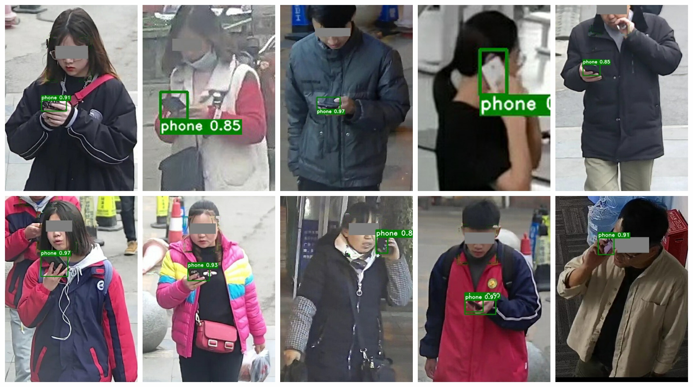
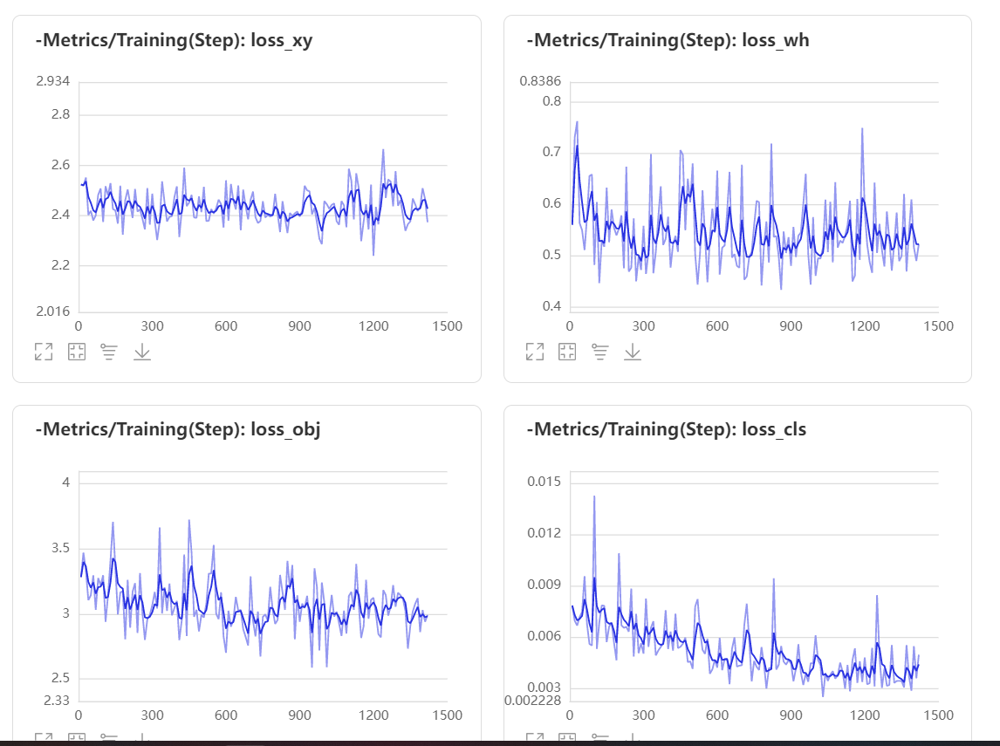
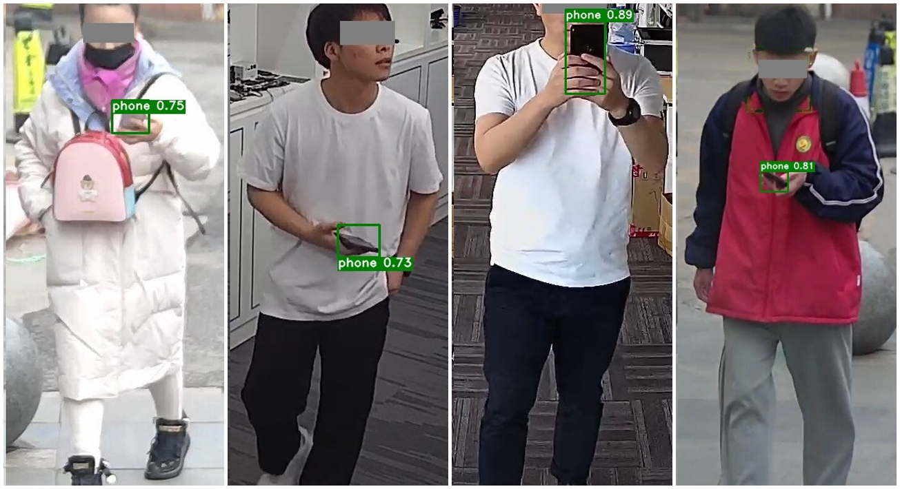
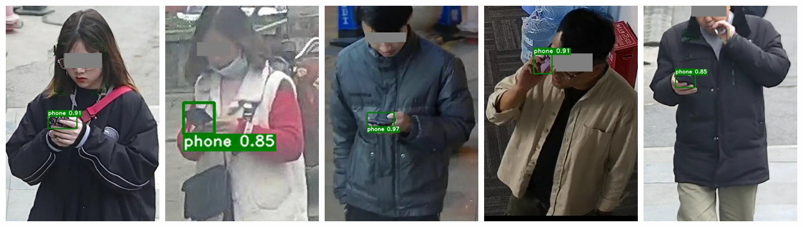

# Phone_det——基于目标检测的违规使用手机识别

AI达人特训营

2022/6/11 雾切凉宫


[TOC]


## 一、项目简介

​        现今，手机已成为人们生活和工作的必需品。但在工业生产环境中，工作人员违规使用手机，屡屡造成安全生产事故，甚至引起人员伤亡。因此，基于工业安全生产和员工人身安全考虑，越来越多的工厂建立起员工手机使用管理规范，限制或禁止员工在生产过程中使用手机。目前，传统的管理手段有两种：一是禁止将手机带入厂区，二是人员监督核查。两种办法均会耗费大量人力，且无法高效、准确地发现员工违规使用手机的情况。如果引入人工智能技术，对设置在生产工区内摄像头采集的视频图片进行分析，快速、准确识别员工违规使用手机的行为，并进行提示和规范，可有效加强安全生产监管，实现降本、提质、增效，加速数字化转型进程。



*以上为在未标注数据集中的检测结果


## 二、数据集来源及分析

使用公共数据集[工业安全生产环境违规使用手机的识别 - 飞桨AI Studio (baidu.com)](https://aistudio.baidu.com/aistudio/datasetdetail/147709)

### 2.1 数据集分析

train.zip：训练集图片集，包含正例和反例数据。0_phone表示正例图片目录，1_no_phone表示反例图片目录          

- 0_phone：正例图片集遵守**VOC数据集**格式（根目录整理为Annotations JPEGImages）
- 1_no_phone：反例图片集中**仅有图片**，无标注信息
- readme.txt 测试集说明文件

test_images_b.zip:     测试集图片集，**仅有图片**，无标注信息


### 2.2 数据集预处理

- 解压数据集至工作目录

```
# 解压数据集
!unzip /home/aistudio/data/data147709/train.zip -d /home/aistudio/work/train
```

- 划分训练、验证、测试集

  [PaddleX](https://github.com/PaddlePaddle/PaddleX)有方便的VOC数据集分割方法，所以这里使用Paddlex的功能。后文中所有代码都要求Paddlex版本>=2.0

```
# 安装paddlex
!pip install paddlex
# 将VOC数据集分割
!paddlex --split_dataset --format VOC --dataset_dir /home/aistudio/work/train/train/0_phone --val_value 0.2 --test_value 0.1
```


## 三、制作VOCDetection数据集

### 3.1 VOCDetection数据集格式说明


#### 数据格式

数据集按照如下方式进行组织，原图均放在同一目录，如`JPEGImages`，标注的同名xml文件均放在同一目录，如`Annotations`，示例如下：

```
MyDataset/ # 目标检测数据集根目录
|--JPEGImages/ # 原图文件所在目录
|  |--1.jpg
|  |--2.jpg
|  |--...
|  |--...
|
|--Annotations/ # 标注文件所在目录
|  |--1.xml
|  |--2.xml
|  |--...
|  |--...
```


#### 训练集、验证集列表和类别标签列表

**为了用于训练，我们需要在`MyDataset`目录下准备`train_list.txt`, `val_list.txt`和`labels.txt`三个文件**，分别用于表示训练集列表，验证集列表和类别标签列表。

* **labels.txt**  

labels.txt用于列出所有类别，类别对应行号表示模型训练过程中类别的id(行号从0开始计数)，例如labels.txt为以下内容
```
dog
cat
snake
```
表示该检测数据集中共有3个目标类别，分别为`dog`，`cat`和`snake`，在模型训练中`dog`对应的类别id为0, `cat`对应1，以此类推

* **train_list.txt**  

train_list.txt列出用于训练时的图片集合，与其对应的标注文件，示例如下
```
JPEGImages/1.jpg Annotations/1.xml
JPEGImages/2.jpg Annotations/2.xml
... ...
```
其中第一列为原图相对`MyDataset`的相对路径，第二列为标注文件相对`MyDataset`的相对路径

* **val_list.txt**  

val_list列出用于验证时的图片集成，与其对应的标注文件，格式与val_list.txt一致


### 3.2 定义数据增强策略

准备好数据集并完成了数据集划分之后。需要对数据集进行预处理和数据增强策略（数据增强可根据实际需求添加），然后定义dataset加载划分好的数据集并建立索引。

*更多的数据增强需求可以参阅[Paddlex数据增强API](https://github.com/PaddlePaddle/PaddleX/blob/develop/docs/apis/transforms/transforms.md)

```python
# 定义数据增强策略
from paddlex import transforms as T
train_transforms = T.Compose([
    T.MixupImage(mixup_epoch=-1),
    T.RandomDistort(),
    T.RandomExpand(im_padding_value=[123.675, 116.28, 103.53]),
    T.RandomCrop(),
    T.RandomDistort(),  # 以一定的概率对图像进行随机像素内容变换，可包括亮度、对比度、饱和度、色相角度、通道顺序调整等
    T.RandomHorizontalFlip(),
    T.BatchRandomResize(
        target_sizes=[192, 224, 256, 288, 320, 352, 384, 416, 448, 480, 512],
        interp='RANDOM'),
    T.Normalize(
            mean=[0.485, 0.456, 0.406], std=[0.229, 0.224, 0.225])
])

eval_transforms = T.Compose([
    T.Resize(
        target_size=320, interp='CUBIC'),
    T.Normalize(
            mean=[0.485, 0.456, 0.406], std=[0.229, 0.224, 0.225])
])
```


### 3.3 数据集读取与预处理

读取VOC格式的检测数据集，并对样本进行相应的处理。VOC数据集格式的介绍可查看文档:[数据集格式说明](https://github.com/PaddlePaddle/PaddleX/blob/develop/docs/data/format/detection.md)

**paddlex.datasets.VOCDetection**参数：

- **data_dir** (str): 数据集所在的目录路径。
- **file_list** (str): 描述数据集图片文件和对应标注文件的文件路径（文本内每行路径为相对`data_dir`的相对路径）。
- **label_list** (str): 描述数据集包含的类别信息文件路径。
- **transforms** (paddlex.transforms): 数据集中每个样本的预处理/增强算子，详见[paddlex.transforms](https://github.com/PaddlePaddle/PaddleX/blob/develop/docs/apis/transforms/transforms.md)。
- **num_workers** (int|str)：数据集中样本在预处理过程中的进程数。默认为'auto'。当设为'auto'时，根据系统的实际CPU核数设置`num_workers`: 如果CPU核数的一半大于8，则`num_workers`为8，否则为CPU核数的一半。
- **shuffle** (bool): 是否需要对数据集中样本打乱顺序。默认为False。
- **allow_empty** (bool): 是否加载无标注框的图片（即负样本）进行训练。默认为False。该参数设置为True时，也要求每个负样本都有对应的标注文件。
- **empty_ratio** (float): 用于指定负样本占总样本数的比例。如果小于0或大于等于1，则保留全部的负样本。默认为1。

```python
# 预处理数据集
import paddlex as pdx
train_dataset = pdx.datasets.VOCDetection(
    data_dir=r'/home/aistudio/work/train/train/0_phone',                    # 数据集目录
    file_list=r"/home/aistudio/work/train/train/0_phone/train_list.txt",    # 训练集文件路径
    label_list=r"/home/aistudio/work/train/train/0_phone/labels.txt",       # 数据标签
    transforms=train_transforms,           # 训练集的数据增强策略
    shuffle=True)                          # 打乱数据集的顺序
eval_dataset = pdx.datasets.VOCDetection(
    data_dir=r'/home/aistudio/work/train/train/0_phone',
    file_list=r'/home/aistudio/work/train/train/0_phone/val_list.txt',
    label_list=r"/home/aistudio/work/train/train/0_phone/labels.txt",
    transforms=eval_transforms)
```


## 四、模型选取与训练

### 4.1 目标检测模型选取

paddlex有许多目标检测模型：

[目标检测模型api文档](https://github.com/PaddlePaddle/PaddleX/blob/develop/docs/apis/models/detection.md)

- paddlex.det.PPYOLOv2
- paddlex.det.PPYOLO
- paddlex.det.PPYOLOTiny
- paddlex.det.PicoDet
- paddlex.det.YOLOv3
- paddlex.det.FasterRCNN

这里选取了**YOLOv3**和**FasterRCNN**两个模型完成任务。


### 4.2 模型训练

**训练参数**

> - **num_epochs** (int): 训练迭代轮数。
> - **train_dataset** (paddlex.dataset): 训练数据集。
> - **train_batch_size** (int): 训练数据batch大小，默认为64。目前检测仅支持单卡batch大小为1进行评估，`train_batch_size`参数不影响评估时的batch大小。
> - **eval_dataset** (paddlex.dataset or None): 评估数据集。当该参数为None时，训练过程中不会进行模型评估。默认为None。
> - **optimizer** (paddle.optimizer.Optimizer): 优化器。当该参数为None时，使用默认优化器：paddle.optimizer.lr.PiecewiseDecay衰减策略，paddle.optimizer.Momentum优化方法。
> - **save_interval_epochs** (int): 模型保存间隔（单位：迭代轮数）。默认为1。
> - **log_interval_steps** (int): 训练日志输出间隔（单位：迭代次数）。默认为10。
> - **save_dir** (str): 模型保存路径。默认为'output'。
> - **pretrain_weights** (str ort None): 若指定为'.pdparams'文件时，则从文件加载模型权重；若为字符串’IMAGENET’，则自动下载在ImageNet图片数据上预训练的模型权重（仅包含backbone网络）；若为字符串’COCO’，则自动下载在COCO数据集上预训练的模型权重；若为None，则不使用预训练模型。默认为'IMAGENET'。
> - **learning_rate** (float): 默认优化器的学习率。默认为0.001。
> - **warmup_steps** (int): 默认优化器进行warmup过程的步数。默认为0。
> - **warmup_start_lr** (int): 默认优化器warmup的起始学习率。默认为0.0。
> - **lr_decay_epochs** (list): 默认优化器的学习率衰减轮数。默认为[216, 243]。
> - **lr_decay_gamma** (float): 默认优化器的学习率衰减率。默认为0.1。
> - **metric** ({'COCO', 'VOC', None}): 训练过程中评估的方式。默认为None，根据用户传入的Dataset自动选择，如为VOCDetection，则`metric`为'VOC'；如为COCODetection，则`metric`为'COCO'。
> - **use_ema** (bool): 是否使用指数衰减计算参数的滑动平均值。默认为False。
> - **early_stop** (bool): 是否使用提前终止训练策略。默认为False。
> - **early_stop_patience** (int): 当使用提前终止训练策略时，如果验证集精度在`early_stop_patience`个epoch内连续下降或持平，则终止训练。默认为5。
> - **use_vdl** (bool): 是否使用VisualDL进行可视化。默认为True。
> - **resume_checkpoint** (str): 恢复训练时指定上次训练保存的模型路径，例如`output/ppyolov2/best_model`。若为None，则不会恢复训练。默认值为None。**恢复训练需要将`pretrain_weights`设置为None。**


#### 4.2.1 YOLOv3训练

```python
# 获取标签总数
num_classes = len(train_dataset.labels)


# 初始化模型
model = pdx.det.YOLOv3(num_classes=num_classes, backbone='MobileNetV1')


# 启动模型训练
model.train(
    num_epochs=24,
    train_dataset=train_dataset,
    train_batch_size=64,
    eval_dataset=eval_dataset,
    #pretrain_weights=None,
    pretrain_weights="COCO",
    learning_rate=0.005 / 12,
    warmup_steps=1000,
    warmup_start_lr=0.0,
    lr_decay_epochs=[105, 135, 150],
    save_interval_epochs=5,
    early_stop=True,
    early_stop_patience=10,
    save_dir='/home/aistudio/work/output/YOLOv3',
    #resume_checkpoint=r"/home/aistudio/work/output/YOLOv3/best_model"
    )


```

*继续训练则将model.train()中两句注释语句恢复。


#### 4.2.2 FasterRCNN训练

```python
# 获取标签总数
num_classes = len(train_dataset.labels)


# 初始化模型
model = pdx.det.FasterRCNN(num_classes=num_classes, backbone='ResNet50')


# 启动模型训练
model.train(
    num_epochs=24,
    train_dataset=train_dataset,
    train_batch_size=64,
    eval_dataset=eval_dataset,
    #pretrain_weights=None,
    pretrain_weights="COCO",
    learning_rate=0.005 / 12,
    warmup_steps=1000,
    warmup_start_lr=0.0,
    lr_decay_epochs=[105, 135, 150],
    save_interval_epochs=5,
    early_stop=True,
    early_stop_patience=10,
    save_dir='/home/aistudio/work/output/FasterRCNN',
    #resume_checkpoint=r"/home/aistudio/work/output/FasterRCNN/best_model"
    )
```

*继续训练则将model.train()中两句注释语句恢复。


### 4.3 训练可视化

可以利用VisualDL实时可视化训练




## 五、模型评估与预测

### 5.1 模型评估

*由于测试集没有标注数据，以下map在训练集中划分评估

| 模型       | 训练轮数 | map       |
| ---------- | -------- | --------- |
| YOLOv3     | 24 epoch | 90.064846 |
| FasterRCNN | 6 epoch  |           |


#### 5.1.1 YOLOv3模型评估

```python
# YOLOv3模型评估
import paddlex as pdx
from paddlex import transforms as T
import os
model = pdx.load_model(r'/home/aistudio/work/output/YOLOv3/best_model')  # 加载训练好的模型

test_transforms = T.Compose([
    T.Resize(
        target_size=320, interp='CUBIC'),
    T.Normalize(
            mean=[0.485, 0.456, 0.406], std=[0.229, 0.224, 0.225])
])
test_dataset = pdx.datasets.VOCDetection(
    data_dir=r'/home/aistudio/work/train/train/0_phone',
    file_list=r'/home/aistudio/work/train/train/0_phone/test_list.txt',
    label_list=r"/home/aistudio/work/train/train/0_phone/labels.txt",
    transforms=test_transforms)
print(model.evaluate(test_dataset))
```


#### 5.1.2 FasterRCNN模型评估

```python
# FasterRCNN模型评估
import paddlex as pdx
from paddlex import transforms as T
import os
model = pdx.load_model(r'/home/aistudio/work/output/FasterRCNN/best_model')  # 加载训练好的模型

test_transforms = T.Compose([
    T.Resize(
        target_size=320, interp='CUBIC'),
    T.Normalize(
            mean=[0.485, 0.456, 0.406], std=[0.229, 0.224, 0.225])
])
test_dataset = pdx.datasets.VOCDetection(
    data_dir=r'/home/aistudio/work/train/train/0_phone',
    file_list=r'/home/aistudio/work/train/train/0_phone/test_list.txt',
    label_list=r"/home/aistudio/work/train/train/0_phone/labels.txt",
    transforms=test_transforms)
print(model.evaluate(test_dataset))
```


### 5.2 模型预测

*以下预测结果在无标注测试集中得到





#### 5.2.1 YOLOv3模型预测

```python
predict_dir=""
model = pdx.load_model(r'/home/aistudio/work/output/FasterRCNN/best_model')  # 加载训练好的模型
pathDir = os.listdir(predict_dir)
count = 0
for path in pathDir:
    count = count+1
    image_name = os.path.join(predict_dir, path)
    result = model.predict(image_name)
    print(result)
    pdx.det.visualize(image_name, result, threshold=0.2, save_dir='./output/predict')  # 将预测好的图片标记并输出到指定目录，threhold代表置信度低于0.6的不进行输出
```

#### 5.2.2 FasterRCNN模型预测

```
predict_dir=""
model = pdx.load_model(r'/home/aistudio/work/output/FasterRCNN/best_model')  # 加载训练好的模型
pathDir = os.listdir(predict_dir)
count = 0
for path in pathDir:
    count = count+1
    image_name = os.path.join(predict_dir, path)
    result = model.predict(image_name)
    print(result)
    pdx.det.visualize(image_name, result, threshold=0.6, save_dir='./output/predict')  # 将预测好的图片标记并输出到指定目录，threhold代表置信度低于0.6的不进行输出
```


## 六、模型部署

……施工中……


参考文章：

https://github.com/PaddlePaddle/PaddleX/blob/develop/docs/data/format/detection.md

https://aistudio.baidu.com/paddle/forum/topic/show/989720

https://github.com/PaddlePaddle/PaddleX/blob/develop/docs/apis/